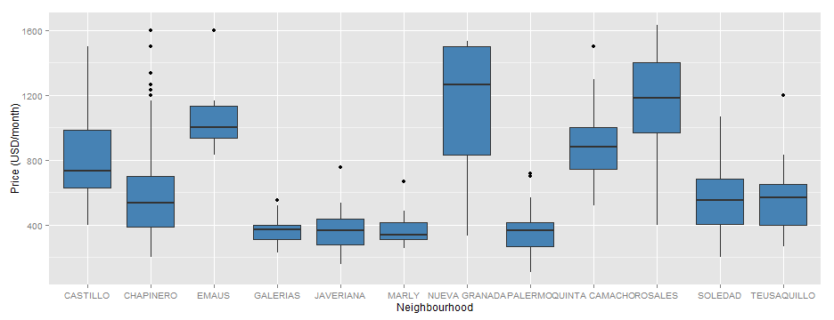

## Motivation
   
+ In the last few years in Bogota, the land price has shown a significant increase due to the high demand.
+ Due to the high prices, people decide to rent apartments instead of buying them.

<iframe src="fig/map3.html" width=100%, height=600></iframe>

--- .class #id 

##  The Data
+ The data of the  properties in rent was obtained from online classified ads of a local newspaper.
+ The data was collected on September 23/2015 using `rvest` package and contains 1000 records of the last published ads.
+ Due to their high demand, only neighbourhoods located in the downtown were considered.


```r
rentdata <- rentdata[complete.cases(rentdata),]
head(rentdata)
```

```
##       price  published     neigh area bathr rms
## 3  466.6667 2015-08-30 CHAPINERO   58     2   2
## 4  416.6667 2015-08-29 CHAPINERO   65     2   2
## 5  350.0000 2015-08-29   SOLEDAD   33     1   1
## 6  600.0000 2015-08-29 CHAPINERO   58     2   1
## 7  900.0000 2015-08-29   ROSALES  100     2   2
## 8 1233.3333 2015-08-29   ROSALES  140     3   3
```


---

## Average monthly rent
The following figure presents a boxplot comparing the distribution of rent prices trough each different neighbourhood.


```r
library(ggplot2)
ggplot(data=rentdata) +geom_boxplot(aes(y=price,x=neigh), fill="steel blue") +
  ylab("Price (USD/month)")+ xlab("Neighbourhood")
```

 

---

## Shiny app
Using this app you can calculate the monthtly rent of your desired apartment in Bogota.
It is powered by a machine learning algorithm to correctly predict the rent ([website](https://mabolivar.shinyapps.io/ShinyApp))

<embed src= https://mabolivar.shinyapps.io/ShinyApp width=100% height=400> </embed>


